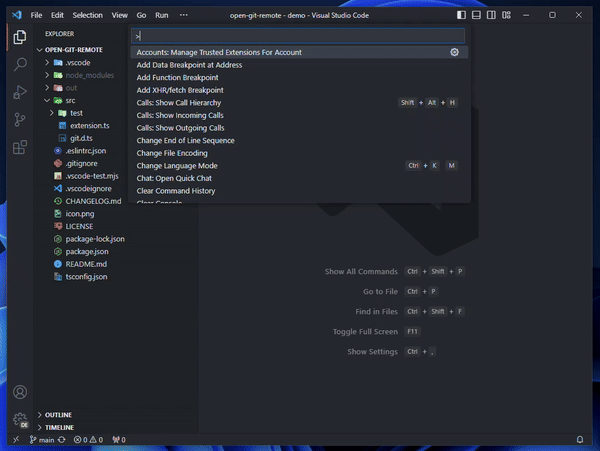

# Open Git Remote

A VS Code extension that does exactly what it says: opens git remotes in the browser

## Usage

Just open your Command Palette, and run `Open Git Remote`

Also check out the [`open-git-remote`](https://github.com/rdsq/open-git-remote-cli) CLI
